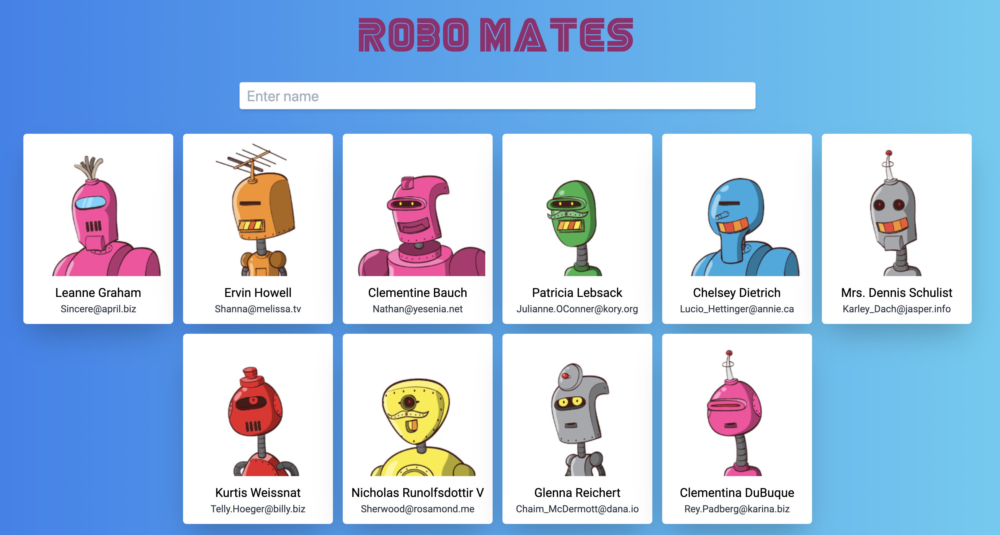

## Robo Mates

A website which shows a list of generated robots. Built using React and the RoboHash API.

Users can filter robots by using their name or email address.

## Installation and Setup Instructions

Clone this repository. You will need `node` and `npm` installed globally on your machine.  

Installation:

`npm install`  

To Start Server:

`npm start`  

To Visit App:

`localhost:3000`
